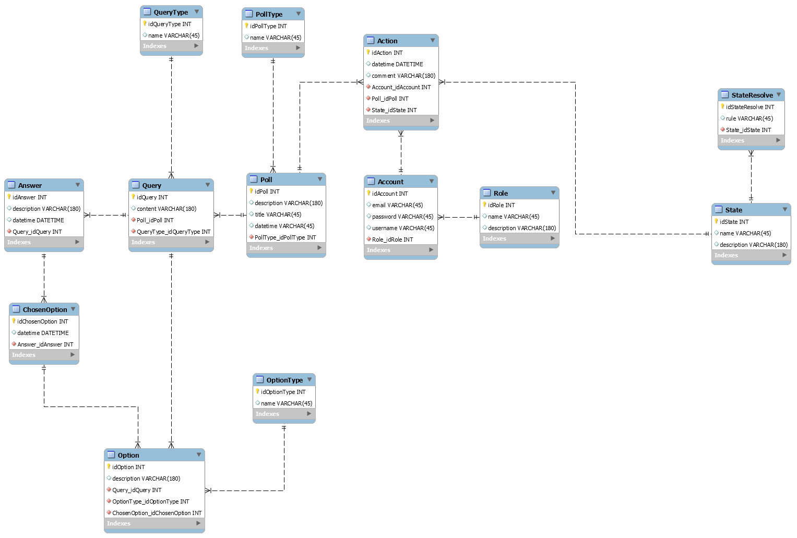

# 🌕Проєктування бази даних

В рамках проекту розробляється: 
 
<h2 style="color: #FFC839;"> ⭐️Модель бізнес-об'єктів </h2>  
@startuml
 entity Client
 
 entity Expert
 entity Expert.id
  
 entity Poll
  
 entity Query

 entity Response
  
 entity Analytic
  
 entity Manager

 entity Patron

  Response "0, *" -u-> "1, 1" Query
  Poll "1, 1" <-u- "0, *"  Query
  Response "0, *" <-u- "1, 1" Expert
  Expert "1, 1" <-u- "1, 1" Client
  Expert "1, 1" -u-> "1, 1" Patron
  Manager "1, 1" -u-> "0, *" Poll
  Manager "1, 1" <-u- "0, *" Patron
  Analytic "1, 1" -u-> "0, *"  Poll

  

@enduml

<h2 style="color: #FFC839;"> ⭐️ER-модель </h2> 

@startuml
    entity Client{
  }
  
  entity Expert{
    id:INT
    name: TEXT
    e-mail: TEXT
    password: TEXT
  }
  
  entity Poll{
    id:INT
    description:TEXT
    concern:TEXT
    datetime:DATETIME
  }
  
  entity Query{
    id:INT
    category:TEXT
    description:TEXT
  }

  entity Response{
    expertId:INT
    id:INT
    description:TEXT
    datetime:DATETIME
  }
  
  
  entity Analytic {
    id: INT
    name: TEXT
    e-mail: TEXT
    phone: TEXT
    password: TEXT
    rating: INT
    
  }
  
  entity Manager {
    id: INT
    name: TEXT
    e-mail: TEXT
    phone: TEXT
    password: TEXT
    rating: INT
    
  }

  entity Patron { 
    id:INT
    name: TEXT
    e-mail: TEXT
    password: TEXT
    rating: INT
  }

  Response "0, *" -u-> "1, 1" Query
  Poll "1, 1" <-u- "0, *"  Query
  Response "0, *" <-u- "1, 1" Expert
  Expert "1, 1" <-u- "1, 1" Client
  Expert "1, 1" -u-> "1, 1" Patron
  Manager "1, 1" -u-> "0, *" Poll
  Manager "1, 1" <-u- "0, *" Patron
  Analytic "1, 1" -u-> "0, *"  Poll

 
@enduml
<h2 style="color: #FFC839;"> ⭐️Реляційна схема </h2> 

