# 1.  Усі аккаунти бази даних (GET)
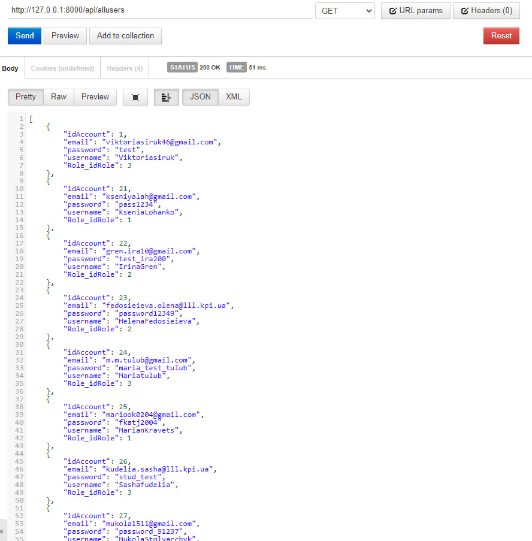</img>
# 2.1 Додавання нового аккаунту (POST)
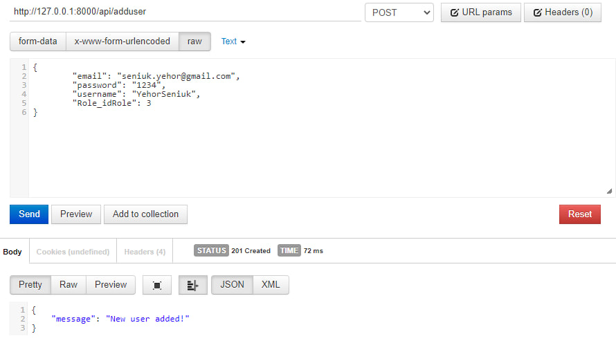</img>
# 2.2 Перевірка, на місці (POST)
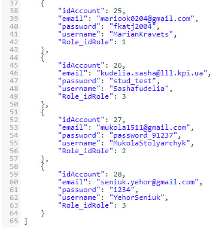</img>
# 2.3 Передача не всіх необхідних даних (POST)
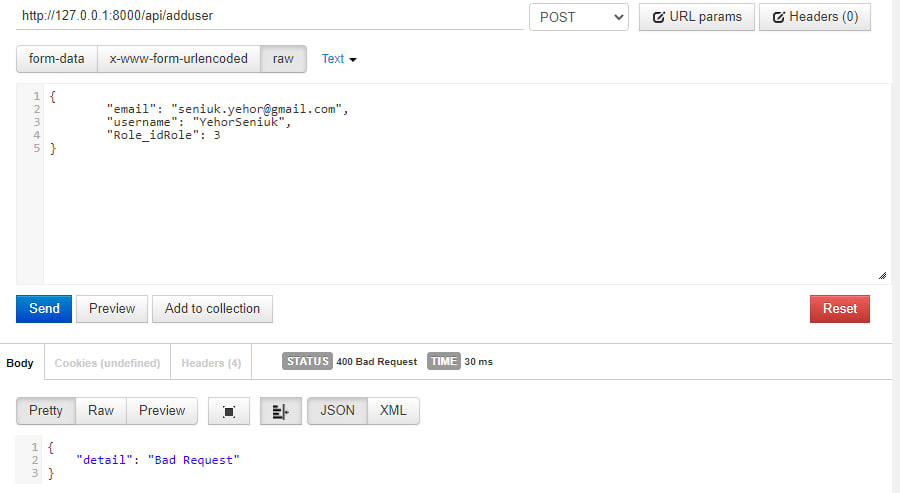</img>
# 3.1 Пошук аккаунту по id (GET)
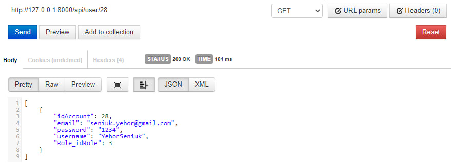</img>
# 3.2 Пошук неіснуючого аккаунту (GET)
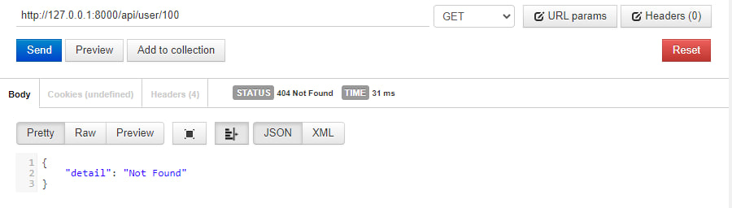</img>
# 4.1 Оновлення аккаунта (PUT)
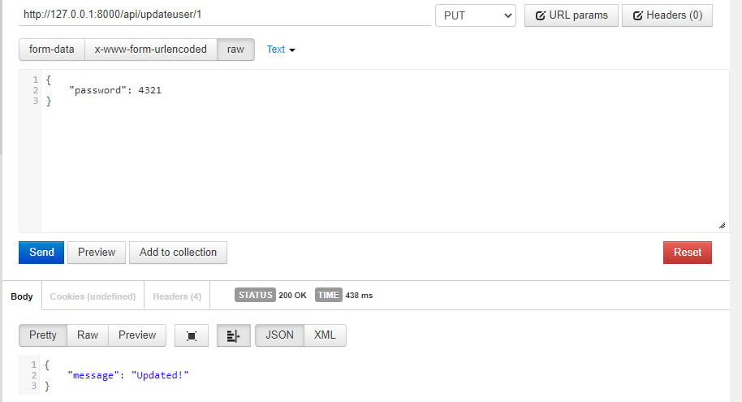</img>
# 4.2 Зміни збережено (PUT)
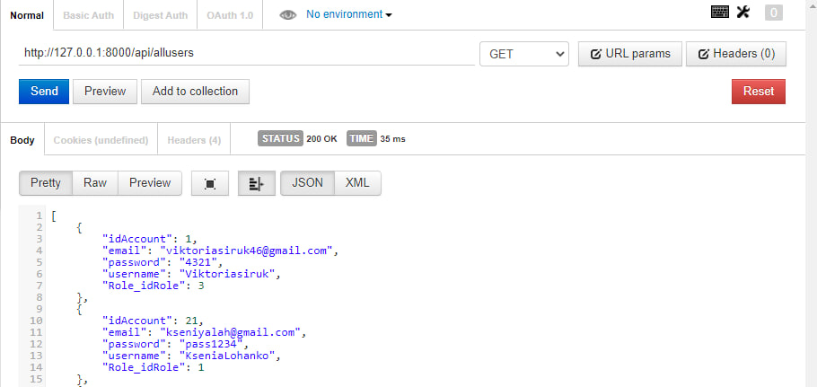</img>
# 4.3 Спроба змінити дані неіснуючого аккаунту (PUT)
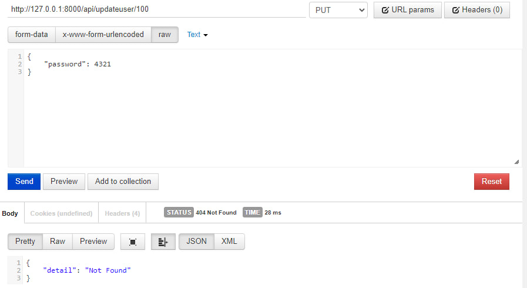</img>
# 5.1 Видалення аккаунту (DELETE)
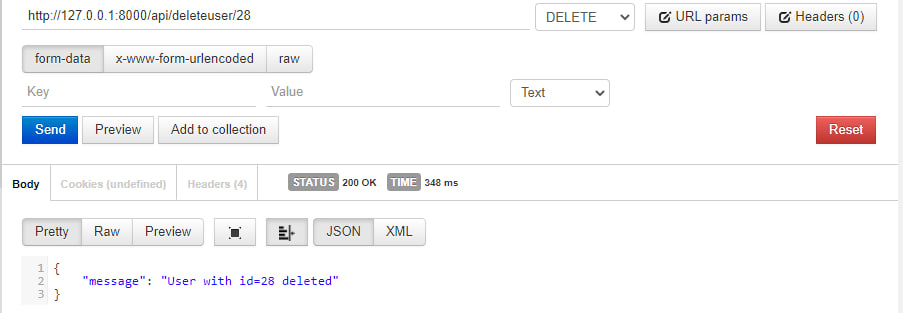</img>
# 5.2 Аккаунту більше нема (DELETE)
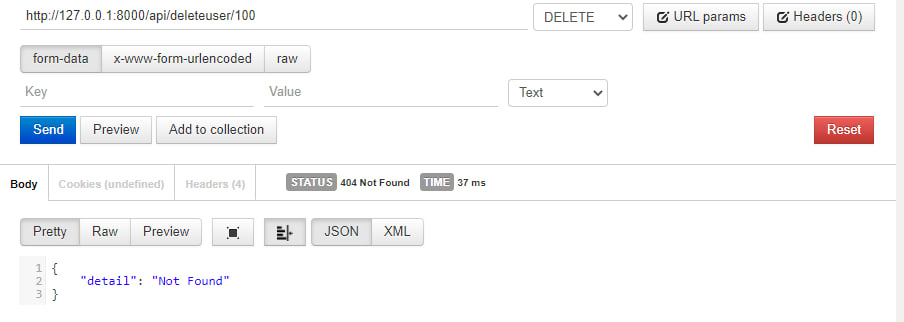</img>
# 5.3 Спроба видалити неіснуючий аккаунт (DELETE)
</img>
